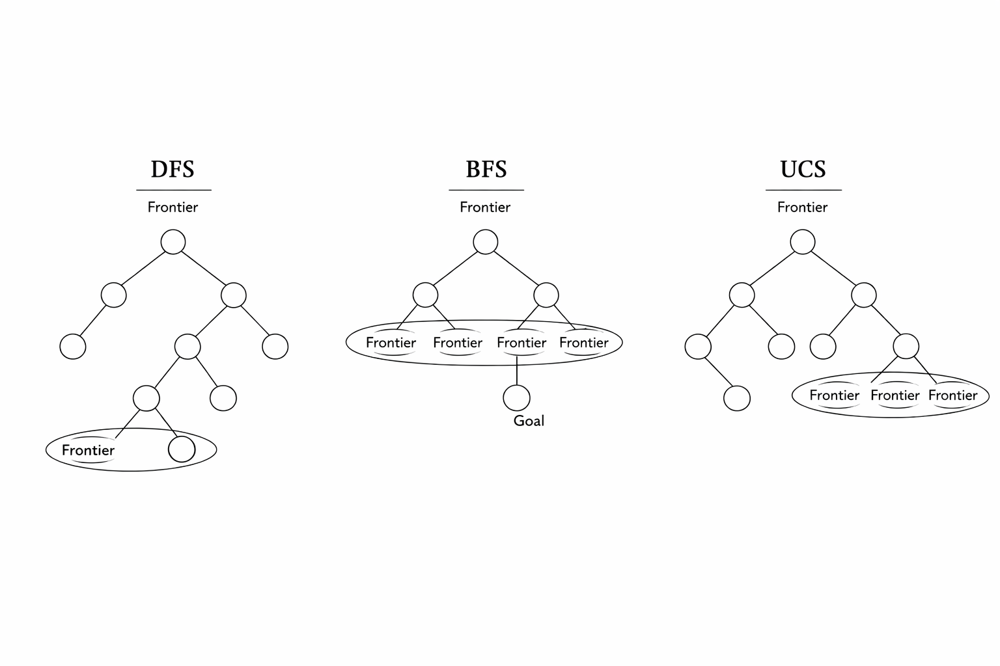

# 1.3 无信息搜索（Uninformed Search）

从起始状态到目标状态找到计划的标准方法是：维护一个来自搜索树部分计划的**前沿（frontier）**。  
我们不断扩展前沿：从前沿中移除一个节点（根据给定策略选择），然后将其所有子节点加入前沿。  
移除并用子节点替换前沿中的元素，相当于丢弃一个长度为 $ n $ 的计划，并将所有长度为 $(n+1)$ 的计划加入考虑范围。  
我们持续进行这一过程，直到从前沿中移除一个目标状态，此时对应的部分计划就是从起始状态到目标状态的完整路径。

实际上，大多数实现会在节点对象中编码以下信息：父节点、到节点的路径长度，以及节点中的状态。  
这一过程称为 **树搜索（Tree Search）**，其伪代码如下：

```text
function TREE-SEARCH(problem, frontier) returns a solution or failure
    frontier ← INSERT(MAKE-NODE(INITIAL-STATE[problem]), frontier)
    while not IS-EMPTY(frontier) do
        node ← POP(frontier)
        if problem.IS-GOAL(node.STATE) then return node
        for each child-node in EXPAND(problem, node) do
            add child-node to frontier
    return failure
```

**EXPAND** 函数返回从给定节点出发，考虑所有可用动作可以到达的所有节点，伪代码如下：

```
function EXPAND(problem, node) yields nodes
    s ← node.STATE
    for each action in problem.ACTIONS(s) do
        s' ← problem.RESULT(s, action)
        yield NODE(STATE=s', PARENT=node, ACTION=action)
```

当我们对目标状态的位置一无所知时，必须从**无信息搜索**（Uninformed Search）方法中选择树搜索策略。下面介绍三种策略：

- 深度优先搜索（Depth-First Search, DFS）

- 广度优先搜索（Breadth-First Search, BFS）

- 统一代价搜索（Uniform Cost Search, UCS）

对于每种策略，我们关注以下属性：

1. **完备性（Completeness）**：如果问题有解，该策略在无限计算资源下是否一定能找到解？

2. **最优性（Optimality）**：该策略是否保证找到到目标状态的最低代价路径？

3. **分支因子 b**：每次从前沿取出节点并加入子节点时，前沿节点数量增加量为 O(b)；在搜索树深度为 k 时，节点数为 O(b^k)。

4. **最大深度 m**

5. **最浅解的深度 s**

---

## 1.3.1 深度优先搜索（Depth-First Search, DFS）

**描述**  
深度优先搜索（DFS）是一种探索策略，它总是选择前沿中最深的节点进行扩展。

**前沿表示**  
移除最深节点并加入其子节点，意味着这些子节点现在成为新的最深节点，其深度比之前的最深节点大 1。  
实现 DFS 时需要一种结构，能够总是优先返回最近加入的元素。**后进先出（LIFO）栈**正好满足这一要求，这也是实现 DFS 时前沿常用的表示方式。


**完备性**  
DFS 并不完备。如果状态空间图中存在循环，搜索树可能无限深，因此 DFS 有可能陷入无限深的搜索而无法找到解。

**最优性**  
DFS 仅找到搜索树中“最左”的解，不考虑路径代价，因此不保证最优。

**时间复杂度**  
最坏情况下，DFS 可能遍历整个搜索树。设搜索树最大深度为 $m$，则 DFS 的时间复杂度为 $O(b^m)$。

**空间复杂度**  
最坏情况下，DFS 在前沿上维护每层深度最多 $b$ 个节点。由于 DFS 在任意时刻只探索某个子树的一条路径，因此空间复杂度为 $O(b^m)$。

---

## 1.3.2 广度优先搜索（Breadth-First Search, BFS）

**描述**  
广度优先搜索（BFS）是一种探索策略，它总是选择前沿中最浅的节点进行扩展。

**前沿表示**  
若希望先访问浅层节点，再访问深层节点，需要按照节点加入的顺序访问节点。BFS 使用**先进先出（FIFO）队列**来表示前沿，以实现这一点。


**完备性**  
如果存在解，最浅解的深度 $s$ 必定有限，因此 BFS 必然会搜索到该深度，BFS 是完备的。

**最优性**  
BFS 通常不保证最优，因为它在选择前沿节点时不考虑路径代价。BFS 保证最优的特殊情况是所有边代价相等，这时 BFS 等价于 UCS 的特殊情况。

**时间复杂度**  
最坏情况下，需要搜索 $1 + b + b^2 + … + b^s$ 个节点，因此时间复杂度为 $O(b^s)$。

**空间复杂度**  
最坏情况下，前沿包含最浅解所在层的所有节点。由于最浅解位于深度 $s$，因此空间复杂度为 $O(b^s)$。

---

## 1.3.3 统一代价搜索（Uniform Cost Search, UCS）

**描述**  
统一代价搜索（UCS）是一种探索策略，它总是选择前沿中代价最低的节点进行扩展。

**前沿表示**  
UCS 通常使用**基于堆的优先队列**来表示前沿。节点 $v$ 的优先级为从起始节点到 $v$ 的路径代价。优先队列会自动调整顺序，以确保每次取出代价最低的节点并加入其子节点。


**完备性**  
UCS 是完备的。若目标状态存在，它必定有一条有限长度的最短路径，UCS 会找到该最短路径。

**最优性**  
假设所有边代价非负，UCS 是最优的。因为 UCS 按路径代价递增顺序扩展节点，保证找到最低代价路径。  
UCS 的策略与 Dijkstra 算法相同，区别在于 UCS 在找到目标状态后即可终止，而 Dijkstra 算法会继续计算到所有状态的最短路径。  
若图中存在负边权，最优性可能失效（可使用 Bellman-Ford 算法处理负权边）。

**时间复杂度**  
设最优路径代价为 $C^*$，状态空间中两节点间最小代价为 $\varepsilon$，则需要探索大约 $O(b^{C^*/\varepsilon})$ 个节点。

**空间复杂度**  
前沿大约包含最便宜解所在层的所有节点，空间复杂度约为 $O(b^{C^*/\varepsilon})$。

---

**备注**  
需要注意的是，上述三种无信息搜索策略本质相同，唯一的区别在于扩展节点的策略。它们的相似性体现在前面介绍的树搜索伪代码中。

---

# 个人补充 #

## 前沿（Frontier）解释

## 1. 前沿的概念

在搜索问题中，**前沿（frontier）**指的是 **当前候选状态集合**，即搜索过程中**下一步可能要扩展的节点集合**。  

- 它是一个**动态集合**，随着搜索的进行不断更新：  
  - **加入新节点** → 当你扩展当前节点时，所有子节点被加入前沿。  
  - **移除节点** → 当你选择一个节点进行扩展时，它从前沿中被移除。

换句话说，**前沿就是搜索树中“已经生成但还没有被扩展的节点”**。  
它是搜索算法的“边界”，标记了哪些路径你已经开始探索，但还没走完。

---

## 2. 前沿和搜索策略的关系

不同搜索策略对前沿的处理方式不同：

| 搜索策略 | 前沿处理方式 | 效果 |
|----------|-------------|------|
| DFS（深度优先） | 后进先出栈（LIFO） | 每次总是扩展最近加入的节点 → 沿着一条路径深入到底 |
| BFS（广度优先） | 先进先出队列（FIFO） | 每次扩展最早加入的节点 → 先扩展浅层节点，保证先找到最浅解 |
| UCS（统一代价） | 优先队列（heap）按路径代价排序 | 每次扩展代价最小的节点 → 保证找到最低代价路径 |

所以，前沿不仅是节点集合，还**决定了搜索顺序**。



---

## 3. 一个简单比喻

把搜索比作探索迷宫：

- **前沿** → 你手里准备去探索的下一个房间清单。  
- **DFS** → 总是选择最近加入清单的房间 → 一直走到底  
- **BFS** → 总是选择最早加入清单的房间 → 按层探索  
- **UCS** → 总是选择到达成本最低的房间 → 最先找到最便宜路径

